<p align="center">
    <a href="https://zushah.github.io/WasmGPU">
        <picture>
            <source media="(prefers-color-scheme: dark)" srcset="https://raw.githubusercontent.com/Zushah/WasmGPU/main/assets/logo-darkmode.png">
            
        </picture>
    </a>
</p>
<p align="center">
    <a href="https://www.github.com/Zushah/WasmGPU/releases/tag/v0.7.0"></a>
    <a href="https://raw.githubusercontent.com/Zushah/WasmGPU/v0.7.0/dist/WasmGPU.js"></a>
    <a href="https://www.npmjs.com/package/@zushah/wasmgpu"></a>
    <a href="https://www.jsdelivr.com/package/gh/Zushah/WasmGPU"></a>
    <a href="https://www.github.com/Zushah/WasmGPU/blob/main/LICENSE.md"></a>
</p><br>

## About

- 🔥 WebGPU × WebAssembly rendering and computing engine for scientific workloads in the browser.
- 🚀 Latest release: [**`v0.7.0`**](https://github.com/Zushah/WasmGPU/releases/tag/v0.7.0).
- 💡 Website: [https://zushah.github.io/WasmGPU](https://zushah.github.io/WasmGPU).
- ⚙️ WebGPU engine written in TypeScript, spanning **scene & assets** (meshes, pointclouds, glyphfields, data materials, lights, cameras, glTF 2.0 assets, mipmapped texture sampling, transparency, animations, 4- or 8-influence skinning, and richer built-in geometry including 2D primitives plus cartesian and parametric curves and surfaces for graphing); **rendering architecture** (WebAssembly-driven frustum culling, opaque draw batching with automatic instanced rendering, optional subpixel morphological anti-aliasing, configurable canvas format selection, and GPU ID-pass picking for both single-hit queries and rectangular or lasso region queries with typed results); **interaction, overlays, & diagnostics** (orbit/trackball orthographic/perspective camera navigation with bounds-based scene framing, inspection views, and a composable overlay and annotation toolkit with triads, grids, legends, markers, probes, and measurements); and **compute & interop** (a first-class WebGPU compute subsystem with reusable pipelines and buffers, an extensive kernels library, an ndarray abstraction, asynchronous readback utilities, a unified scale-transform model shared across rendering and computing workflows, and Python-in-the-browser interoperability).
- 🦀 WebAssembly driver written in Rust, spanning **data layout & transforms** (transforms stored in SoA memory with per-index dirty tracking and partial local or world propagation plus model and normal matrix packing); **animation & asset hot paths** (animation sampling and joint-matrix generation executed in WebAssembly together with glTF accessor deinterleaving, sparse patch application, numeric conversion, and mesh normal generation); **bounds, culling, & visibility** (world-space bounds computation for geometry, pointclouds, and glyphfields together with frustum plane extraction and sphere-frustum culling kernels); **array semantics & zero-copy staging** (ndarray indexing utilities for explicit shape-and-stride byte-offset math plus uniforms and instance data staged as zero-copy views into WebAssembly memory with explicit typed-slice handles for JavaScript interop); and **performance envelope** (hot-path allocations avoided via cached pipelines and bind-group layouts plus a frame arena and user heap arenas, with builds optimized via LLVM and Binaryen and SIMD128 enabled for even higher throughput).

## Architecture Diagram

The diagram below reflects the current runtime flow of WasmGPU.

Solid arrows indicate control flow while dashed arrows indicate data flow.

Click [here](https://mermaid.live/view#pako:eNp9WG1v4jgQ_itWTtpPbsVLKS0rnZRC6FZLKQJ6SHe9DyYYyDWJc47Tllvtf78ZOySxKVuttuHJeDyvzwz94YViw72Bt43Fe7hnUpHJ_CUl8JMX651k2Z74s4e_XrxZsY6jED-8eH8bCfzxZzN4-ZxzSfwsAwmmIpFaIsH0HkRWLE_uZ8_krXXZv2xZAmN_CAJjFiohD3Cv3LKQD0ge8pRTErKESwa_RaqkiHNKdlwkXMkDJQlTXEYspkTxD1VIEE94vqckE1GqwlgUGxCPD9l-G_EYnuNot1eUsDznikRJJiR-SqNEm02JeOMyZgfEUqFsX3i6eUmd2MyX6Bpfo2dBuotSbnk2eXrC8Iwl-EBiITLr7TyYjuDtHBRzyaX1bjH0JwG8XIQsjtIdgQC_RaGt_emPYA4iT8ZmssVb3oV8tRM0nT6BkF_5Q5QQ8WukLKnZw_A7JjkKX_G2QkVxpA6WyNDUwVAkWaE4hiA_5IonttDd8xiE7ortFipC8lwUMuSQp5TtHA-Hs4dZoO_MOLjIjwmOT-Qm_hTkRlGeMRXuCbq4k6LISBZDmlzx78Ecxb9zmfI4h4yvJZOuK3MM3PRiEyU8zSEoLCZMSggiW-dKQiVioLZCwu3P5AvB9CY8Ea6eeeBjBv38kIZ7KVJR5OA026xZ-EokRNIWXwznOqVS-7E2QcogHb-ssZG_9DHN6394qMCYEVOMPELbxk7FTLVy7tTgcrF8mmOgl5KlOfiUkBwajZMoJQvhf-bXY7D4BgceoZXIe6T2n3bcl2PP2YV0j80-q9oPxOr-s6Px6M90PcVgEssyN1qL7w_aIShIMDVXLIVC2oDvdnkfvWsUuHbPlpo86URNBINW04ndxcsx6Vy2Si44VTwKkJX8MOR5DvIbDkyJvfFFy2K1Qt_lLtn5D4_o1YOmFrxKiqRxBTSf4bWqN_Jf5n7lLx4Nw_igI1nHBzKS0ZtT86tvgY7lN84ywuJYGBbWfmZoJPRpqog6ZHzzWb5XY39e0RSTPGX6qMKCiX59cjm3KiuTImO70xmwevSXuqSYktEHJW8cyR6L6N8CKypFc6G29hyZOMztw5omP-vWCJjzwyQF2jba8Aux3UKslVtMq2ZJp1hwMRQ1cMcnpt5PlshhukCYm35KgIVkzonmIg18IWkBIwqG45maWPnTB12h5ZghOUuy2Jj9D3YKeg5hOWvR3dPzdLRAXhVFusl1ck7n3NlOWw2fJxOd3yJXRULCIo6bAfqs8IDx8D4p3nG0z0-KFX9GwR8gc4_ykDIIEU4onVJecIdwh99srmfhHkXXkEHD5RpxxuOiqd7QZV6N-hw91pEE1D448xeLarBCpqB1TNCgOMG4Bp3pEs-w5FUDzUSuLqCUMfdligsMA8Sal8PBGVHmwuNsbNz4asbQZ7EOYxAb8S0Qg3xdx2DXNorjwW9XQf92PKZQ0OKVD35r3XXubo4fL96jjdoPOtkHDZE44fV1u9cdfXVU7iTnaamv0xl1-6Nan3896g7P67vqttu-q0_vTQ0b2_2hZWOrF9y0zuvsdK66XVfngQNTvZcKx-O7TvemUnjrX41a5xX2_M6w1XIVZoWEYigV3rVv_IaFcGLsX59V2Ana173gRGGUvlb29QK_aV8nuO6cVXc1gqR0vlqZxlWZwi5MYd2tUt68UW-LFJdCqrc_ivsdxf2N4npmcmodwJWM4spF9TJF9apE9QZEccehekGhuHfUGbQ0wNJAzYJAkSEpjG-Kg5ni9KVmuFI9PSkORIrjrUycpUdPIIpzhMJIoJruKfA21cRLNadS5EFakhnVpFSmzFIFrEI1X0AoFlT3MtUNptNRipr_IaLk4uJ3_IZhAHjQAITYBjC0NoLBtRGMtI1g2G0EI37MKuYRMYihDaDLNgJhtQGMsaMFAm4jOuwGQo2Nc6X3-N5IQmrMA6SnfImJurhsmldDtYENser-GjOVUaL6DkR1Mo9GYGD11Vi3BoILHcToccDKpxqCMDkI-uuqB0MdCHPpQPjk5FA3kZ1ovzasAcJTo0RKQyDxJgPQbi6EzXeCQSu6GDami0GbuhA2rYtBCzuQ5ohjxOHRKb0aq4qvhuryQ3dKg6HFSgz9OQXBoRMQPToBkW5OTmMDIwjtXULoZg05aZvXZytMs8IxCvBo65vbVzT6VhctElSzZDUIfGUw_fq06BtwnSg8ZbDTCtdal0fBZSmn6bBZvRoENizl4OlE0LSHAaukrmq0BhuShlsbzXSClh_KN8jBzSA7oOFox9XKKytQlQtA2iWENGEw5I4TcFUpPN7c6AVdlefcrK6oja6g-qSGPOrt4HuBN1Cy4NSDNT1h-NH7geIvHn7hgK1zAI84kl-8l_QnnMlY-qcQyfEYLKi7vTfYsjiHT0UG3-T4KGKwKdcietccwn6uvAFsO1qHN_jhfXiD9mXnut26ven1ey341-3dUu_gDS5agPf6_fbNVafd63e63dvuT-r9py9uXQLevm5dXd90O-2bPiwbHt9E8KXp0fzBTv_d7uf_9Ya82A) to interactively view the diagram if it doesn't properly appear below.

```mermaid
flowchart LR
    subgraph API["Public API"]
        APP["User Application"]
        ENG["WasmGPU v0.7.0"]
        FAC["Factory surface: scene, camera, controls, geometry, material, texture, mesh, pointcloud, glyphfield, light, asset import, animation, overlay, annotation"]
    end

    subgraph RT["WebGPU Engine"]
        LOOP["Frame loop"]
        REND["Renderer"]
        SCALE["Scaling service"]
        OVER["Overlay framework"]
        ANNO["Annotation toolkit"]
        PICK["Picking utility"]
        CAPI["Compute subsystem"]
        CBUF["Buffer resource manager"]
        CPIPE["Pipeline controller"]
        CPLAN["Dispatch workgroup planner"]
        CKERN["Kernels library"]
        CARR["N-dimensional array abstraction for CPU & GPU memory"]
        CREAD["Asynchronous readback ring"]
        CSCR["Scratch buffer pool"]
    end

    subgraph DATA["Object & Data Model"]
        SCN["Scene"]
        TSTORE["Transform store in SoA memory"]
        MESH["Mesh with geometry, material, & texture"]
        PGG["Pointcloud & glyphfield"]
        CMAP["Colormapping"]
        SKIN["Skin instance data"]
        ASTORE["Annotation store"]
        ALOAD["Loader for glTF 2.0 asset data"]
        ADEC["Accessor decoding & data conversion"]
        AIMP["Importer from asset data to scene resources"]
    end

    subgraph WASM["WebAssembly Driver"]
        WHEAP["Heap allocation for persistent typed memory"]
        WFAR["Frame arena for transient typed memory"]
        WTR["Transform propagation"]
        WMATH["Matrix, vector, & quaternion mathematics"]
        WND["N-dimensional array indexing & stride-offsetting"]
        WMESH["Mesh normal generation"]
        WGLTF["glTF accessor decoding, sparse patching, & numeric conversion"]
        WANI["Animation sampling & joint matrix generation"]
        WBOUNDS["Bounds for mesh, pointcloud, & glyphfield"]
        WCULL["Frustum culling"]
    end

    subgraph GPU["Browser Resources"]
        DEV["Graphics device & queue"]
        CACHE["Pipeline cache & bindgroup cache"]
        RES["Graphics buffers, textures, & samplers"]
        RPASS["Render passes for opaque geometry, transparent geometry, post-processing, & user interaction"]
        CPASS["Compute passes for kernels"]
    end

    classDef darkblue fill:#4E79FF,stroke:#0B2B8F,stroke-width:2px,color:#06153D;
    classDef green fill:#22D37D,stroke:#0A6D3C,stroke-width:2px,color:#04311A;
    classDef lightblue fill:#17C9FF,stroke:#005E80,stroke-width:2px,color:#022433;
    classDef yellow fill:#FFB238,stroke:#9A4D00,stroke-width:2px,color:#5A2C00;
    classDef purple fill:#B18AFF,stroke:#5A2FA6,stroke-width:2px,color:#2E165E;
    classDef pink fill:#FF5EA8,stroke:#9A2E62,stroke-width:2px,color:#4D1532;

    class APP,ENG,FAC darkblue;
    class LOOP,REND,SCALE,OVER,ANNO,PICK green;
    class CAPI,CBUF,CPIPE,CPLAN,CKERN,CARR,CREAD,CSCR lightblue;
    class SCN,TSTORE,MESH,PGG,CMAP,SKIN,ASTORE,ALOAD,ADEC,AIMP yellow;
    class WHEAP,WFAR,WTR,WMATH,WND,WMESH,WGLTF,WANI,WBOUNDS,WCULL purple;
    class DEV,CACHE,RES,RPASS,CPASS pink;
    
    APP --> ENG
    ENG --> FAC
    ENG --> LOOP
    ENG --> OVER
    ENG --> ANNO
    ENG --> PICK
    ENG --> CAPI

    FAC --> SCN
    FAC --> MESH
    FAC --> PGG
    FAC --> CMAP
    FAC --> SKIN
    FAC --> ALOAD
    MESH --> CMAP

    ALOAD --> ADEC --> AIMP
    AIMP -.-> SCN
    AIMP -.-> MESH
    AIMP -.-> SKIN
    AIMP -.-> TSTORE
    ADEC -.-> WGLTF

    LOOP --> REND
    SCN --> REND
    TSTORE --> REND
    MESH --> REND
    PGG --> REND
    CMAP --> REND
    SKIN --> REND
    OVER --> REND
    REND --> PICK
    PICK --> ANNO
    ASTORE --> ANNO
    ANNO --> OVER

    CAPI --> CBUF
    CAPI --> CPIPE
    CAPI --> CPLAN
    CAPI --> CKERN
    CAPI --> CARR
    CAPI --> CREAD
    CAPI --> CSCR
    CAPI --> SCALE
    SCALE --> MESH
    SCALE --> PGG
    SCALE --> CMAP
    CBUF --> CPASS
    CPIPE --> CPASS
    CPLAN --> CPASS
    CKERN --> CPASS
    CSCR --> CPASS
    CPASS --> DEV
    CREAD --> DEV

    REND --> RPASS
    REND --> CACHE
    CACHE --> DEV
    RPASS --> DEV

    ENG -.-> WHEAP
    LOOP -.-> WFAR
    WHEAP -.-> TSTORE
    WHEAP -.-> CARR
    WFAR -.-> REND
    TSTORE -.-> WTR
    WTR -.-> WMATH
    SKIN -.-> WANI
    WANI -.-> WMATH
    MESH -.-> WMESH
    WMESH -.-> MESH
    MESH -.-> WBOUNDS
    PGG -.-> WBOUNDS
    WBOUNDS -.-> WCULL
    REND -.-> WCULL
    WCULL -.-> REND
    WTR -.-> TSTORE
    WANI -.-> RES
    WGLTF -.-> ADEC
    WGLTF -.-> WND
    WND -.-> CARR
    CBUF -.-> MESH
    MESH -.-> RES
    REND -.-> RES
    CBUF -.-> RES
```



## Architecture Comparison Tables

### 1. Platform and Toolchain
|  | **WebGL / WebGPU** | **Three.js / Babylon.js** | **WasmGPU** |
| :--- | :--- | :--- | :--- |
| **Origin** | 2011 / 2023 | 2010 / 2013 | 2026 |
| **Implementation Language** | JavaScript & C++ | JavaScript / TypeScript | TypeScript & Rust |
| **Application Language** | JavaScript & GLSL / WGSL | JavaScript / TypeScript & GLSL / WGSL | JavaScript / TypeScript & WGSL (& Python via Pyodide) |
| **Buildtime Optimization** | Not available | Transpilation, tree-shaking, minification | Transpilation & LLVM, tree-shaking & Binaryen, minification |
| **Graphics Engine** | WebGL / WebGPU | WebGL-native & WebGPU-adoptive | WebGPU-native |
| **Vectorization** | Not available | Scalar | SIMD128 |
| **API Ergonomics** | Verbose | Streamlined | Streamlined |

### 2. Execution Model and Memory Layout
|  | **WebGL / WebGPU** | **Three.js / Babylon.js** | **WasmGPU** |
| :--- | :--- | :--- | :--- |
| **Scene Graph Memory** | Not available | Object-oriented (AoS) | Data-oriented (SoA) |
| **Math Execution** | JavaScript | JavaScript | WebAssembly |
| **Transform Updates** | Not available | Recursive traversal | Linear iteration |
| **Bounds Computation** | Manual | JavaScript | WebAssembly |
| **View Framing** | Manual | Helper-based fitting | Bounds-based scene/object fitting |
| **Garbage Collection** | Manual & low/high pressure via JavaScript engine | Automatic & high pressure via JavaScript engine | Automatic & low pressure via WebAssembly driver |
| **Render Loop** | Run by JavaScript | Run by JavaScript | Run by JavaScript & WebAssembly |

### 3. Rendering Pipeline Infrastructure
|  | **WebGL / WebGPU** | **Three.js / Babylon.js** | **WasmGPU** |
| :--- | :--- | :--- | :--- |
| **Uniform Uploads** | Manual packing | Extraction & packing | Zero-copy views & no packing |
| **Render State Caching** | Manual | State filtering | Pipeline caching |
| **Instancing** | Manual | Manual | Automatic |
| **Visibility Culling** | Not available | Frustum culling in JavaScript | Frustum culling in WebAssembly |
| **Picking** | Manual GPU / CPU picking | Often CPU-centered | GPU ID-pass with typed hits |
| **Skinning** | Not available | Data textures | Storage buffers |
| **Anti-aliasing** | Not available | MSAA | SMAA |
| **Textures** | Manual | Managed objects | Managed objects |
| **Animation System** | Not available | Executed in JavaScript | Executed in WebAssembly |
| **Asset Importing** | Not available | glTF 2.0 | glTF 2.0 |
| **Camera Controls** | Not available | Built-in | Built-in unified orbit & trackball navigation |

### 4. Compute Workloads and Scientific Visualizations
|  | **WebGL / WebGPU** | **Three.js / Babylon.js** | **WasmGPU** |
| :--- | :--- | :--- | :--- |
| **GPGPU** | Manual, low-level, high-boilerplate | Integrated, high-abstraction, scene-centric | Automated, kernel-driven, compute-optimized |
| **Ndarray Abstraction** | Not available | Not available | CPU & GPU ndarrays |
| **GPU Readback** | Manual | Manual | Async readback ring |
| **Python Interoperability** | Not available | Not available | With Pyodide |
| **Scientific Primitives** | Manual | Manual | Point clouds & glyph fields |
| **Mathematical Geometry** | Manual | Manual | Cartesian & parametric curves & surfaces |
| **Scaling Statistics** | Manual | Manual | Min/max & percentile analysis |
| **Colormap Support** | Manual | Manual | Built-ins & custom |
| **Data-driven Materials** | Manual | Manual | Data material |
| **Scientific Overlays** | Manual | Manual | Grids, triads, & legends |
| **Annotation & Measurement** | Manual | Manual | Markers, probes, distance, & angle toolkit |

## Getting Started

Examples: 
1. [`./examples/esm.html`](https://zushah.github.io/WasmGPU/examples/esm.html) to see how to get started with the ESM build.
2. [`./examples/iife.html`](https://zushah.github.io/WasmGPU/examples/iife.html) to see how to get started with the IIFE build.
3. [`./examples/gltf.html`](https://zushah.github.io/WasmGPU/examples/gltf.html) to see how a glTF model of a chessboard can be loaded and imported.
4. [`./examples/controls.html`](https://zushah.github.io/WasmGPU/examples/controls.html) to see how the camera controls and navigation functionalities work.
5. [`./examples/picking.html`](https://zushah.github.io/WasmGPU/examples/picking.html) to see how the picking, probing, and selecting utility works.
6. [`./examples/scaling.html`](https://zushah.github.io/WasmGPU/examples/scaling.html) to see how the scaling service and colormapping works.
7. [`./examples/overlay.html`](https://zushah.github.io/WasmGPU/examples/overlay.html) to see how the overlay framework and annotation toolkit works.
8. [`./examples/mandelbulb.html`](https://zushah.github.io/WasmGPU/examples/mandelbulb.html) to see how the compute subsystem can be used to render a Mandelbulb fractal.
9. [`./examples/galaxy.html`](https://zushah.github.io/WasmGPU/examples/galaxy.html) to see how a point cloud can be used with Python intero via Pyodide and the compute subsystem to render a realistic galaxy.
10. [`./examples/fluid.html`](https://zushah.github.io/WasmGPU/examples/fluid.html) to see how a glyph field and a point cloud can be used with Python interop, the compute subsystem, navigation, selection, and overlay features to render a fluid dynamics demo.
11. [`./examples/graphing.html`](https://zushah.github.io/WasmGPU/examples/graphing.html) to see how the mathematical function primitives and data materials can be used with Python interop, navigation, selection, and overlay features to render for a 3D graphing calculator.
12. [`./examples/protein.html`](https://zushah.github.io/WasmGPU/examples/protein.html) to see how a point cloud can be used with Python interop, navigation, selection, colormap, and overlay features to render a visualization of a protein structure (hemoglobin) from the Protein Data Bank.

Super basic example to render a cube:
```js
// Setup
import { WasmGPU } from "@zushah/wasmgpu";
const canvas = document.querySelector("canvas");
const wgpu = await WasmGPU.create(canvas, { antialias: true});

// Scene, camera, and controls
const scene = wgpu.createScene([0.05, 0.05, 0.1]);
const camera = wgpu.createCamera.perspective({
    fov: 60,
    near: 0.1,
    far: 1000
});
camera.transform.setPosition(-2, 2, -2);
camera.lookAt(0, 0, 0);
const controls = wgpu.createControls.orbit(camera, canvas);

// Light
scene.addLight(wgpu.createLight.directional({
    direction: [1, -1, -1],
    color: [1, 1, 1],
    intensity: 1.5
}));

// Cube
const cube = wgpu.createMesh(
    wgpu.geometry.box(1, 1, 1),
    wgpu.material.standard({
        color: [1, 0, 0],
        metallic: 0.7
    })
);
scene.add(cube);

// Render
wgpu.run((dt, time) => {
    controls.update(dt);
    wgpu.render(scene, camera);
});
```

Using the IIFE bundle instead of the ESM bundle is exactly the same as above, except you must use an HTML `script` tag instead of a JavaScript `import` statement:
```html
<script src="https://cdn.jsdelivr.net/gh/Zushah/WasmGPU@0.7.0/dist/WasmGPU.iife.min.js"></script>
```

To get started with the comprehensive [documentation](https://zushah.github.io/WasmGPU/docs/), consider visiting the pages for these fundamentals first:
- [`WasmGPU.create`](https://zushah.github.io/WasmGPU/docs/render/wasmgpu-create/)
- [`WasmGPU.compute.createPipeline`](https://zushah.github.io/WasmGPU/docs/compute/wasmgpu-compute-createpipeline/)
- [`WasmGPU.createMesh`](https://zushah.github.io/WasmGPU/docs/objects/wasmgpu-createmesh/)
- [`WasmGPU.createCamera.perspective`](https://zushah.github.io/WasmGPU/docs/world/wasmgpu-createcamera-perspective/)
- [`WasmGPU.createControls.orbit`](https://zushah.github.io/WasmGPU/docs/interact/wasmgpu-createcontrols-orbit/)
- [`WasmGPU.python`](https://zushah.github.io/WasmGPU/docs/interop/wasmgpu-python/)
- [`WasmGPU.math`](https://zushah.github.io/WasmGPU/docs/math/wasmgpu-math/)

## Contributing

Asking questions, reporting bugs, suggesting features, and contributing code is very welcome. The guidelines can be found [here](https://www.github.com/Zushah/WasmGPU/blob/main/CONTRIBUTING.md).

## License

WasmGPU is available under the [Mozilla Public License 2.0 (MPL-2.0)](https://www.github.com/Zushah/WasmGPU/blob/main/LICENSE.md).
