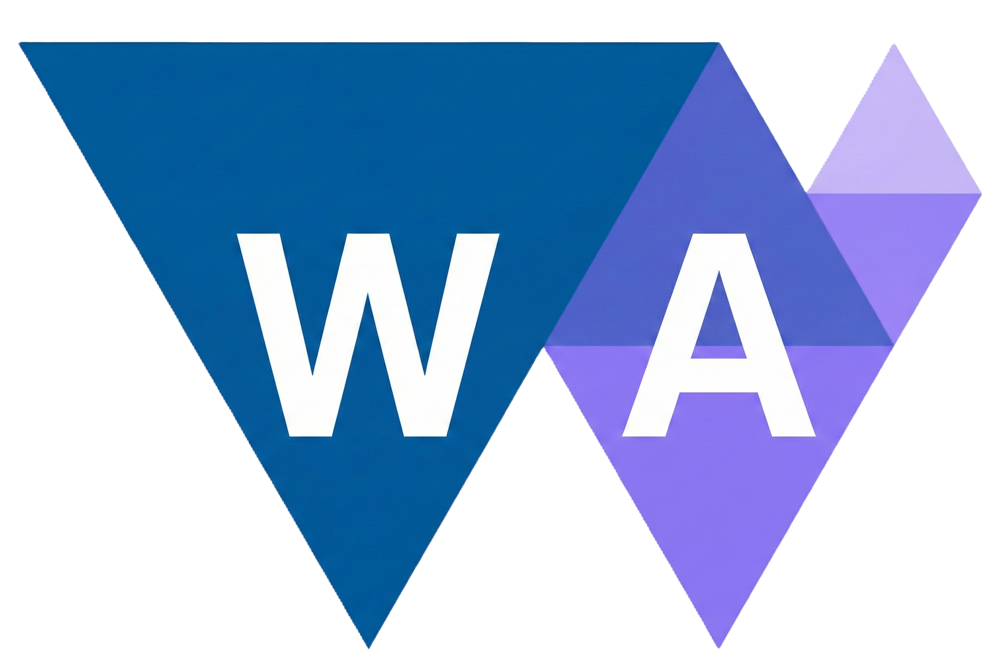

<p align="center"><a href="https://www.github.com/Zushah/WasmGPU"></a></p>
<h3 align="center"><b>W a s m G P U &nbsp;&nbsp;=&nbsp;&nbsp;  W e b A s s e m b l y &nbsp;&nbsp;⨯&nbsp;&nbsp; W e b G P U</b></h3><br>

## Status (v0.1.0)

- ✅ WebGPU core working (renders a rotating cube)
- ✅ AssemblyScript → Wasm math module wired into TS
- ✅ Builds for both **ESM** and **IIFE** consumers
- 🛠️ API still evolving so expect breaking changes!

## Build Outputs

The `dist/` folder contains:

- `WasmGPU.js` / `WasmGPU.min.js` — **ESM** bundle
- `WasmGPU.iife.min.js` — **IIFE** bundle (global `WasmGPU`)
- `math.js` — AssemblyScript ESM bindings (loads wasm)
- `math.wasm` — WebAssembly module

> **Important:** `math.js` and `math.wasm` must be hosted next to the WasmGPU bundle (same `dist/` directory).

## Usage

### ESM (recommended)

```html
<canvas></canvas>
<script type="module">
	import { WasmGPU } from "@zushah/wasmgpu";

	const canvas = document.querySelector("canvas");
	const wgpu = await WasmGPU.create(canvas);
	wgpu.setClearColor(255, 255, 255);

	function frame(t) {
		wgpu.renderFrame(t * 0.001);
		requestAnimationFrame(frame);
	}
	requestAnimationFrame(frame);
</script>
```

### CDN (script tag global)
```html
<canvas></canvas>
<script src="https://cdn.jsdelivr.net/gh/Zushah/WasmGPU@0.1.0/dist/WasmGPU.iife.min.js"></script>
<script>
	const canvas = document.querySelector("canvas");

	WasmGPU.create(canvas).then(wgpu => {
		wgpu.setClearColor(255, 255, 255);

		function frame(t) {
			wgpu.renderFrame(t * 0.001);
			requestAnimationFrame(frame);
		}
		requestAnimationFrame(frame);
	});
</script>
```

## Devlopment
1. Install dependencies: `npm install`
2. Build: `npm run build`
3. Serve locally: `npm run start` or use the [live server extension](https://marketplace.visualstudio.com/items?itemName=ritwickdey.LiveServer)

Quick examples: `examples/esm.html` and `examples/iife.html`.

## License
WasmGPU is available under the [Mozilla Public License 2.0 (MPL-2.0)](https://www.github.com/Zushah/WasmGPU/blob/main/LICENSE.md).
