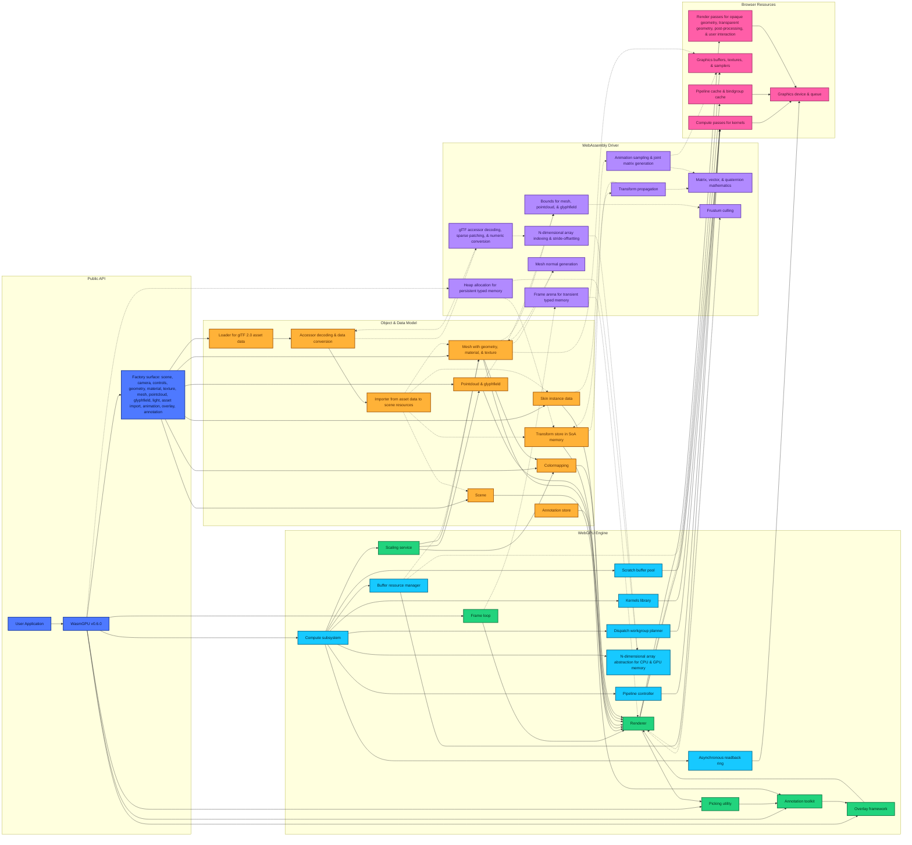

# WasmGPU v0.6.0

WebGPU × WebAssembly rendering and compute engine for scientific workloads in the browser.

- WebGPU engine written in TypeScript, spanning **scene & assets** (meshes, point clouds, glyph fields, materials, lights, camera, and glTF 2.0 with PBR or unlit materials, mipmapped texture sampling with robust asynchronous uploads, transparency, animations, and 4- or 8-influence skinning); **rendering architecture** (WebAssembly-driven frustum culling, opaque draw batching with automatic instanced rendering, and optional subpixel morphological anti-aliasing via SMAA); **interaction & diagnostics** (built-in orbit and trackball controls and a HUD for performance stats); and **compute & interop** (a first-class WebGPU compute API with reusable pipelines and buffers, an ndarray abstraction, asynchronous readback utilities, and Python-in-the-browser interop for scientific workloads).
- WebAssembly driver written in Rust, spanning **data layout & transforms** (transforms stored in SoA memory with per-index dirty tracking and partial local/world propagation); **animation execution** (animation sampling and joint-matrix generation executed in WebAssembly and streamed to WebGPU storage buffers); **array semantics** (ndarray indexing utilities for explicit shape-and-stride byte offset math); **zero-copy staging** (uniforms and instance data staged as zero-copy views into WebAssembly memory with explicit typed-slice handles for JavaScript interop); and **performance envelope** (hot-path allocations avoided via cached pipelines and bind-group layouts plus a reset-every-frame arena and user heap arenas, with builds optimized via LLVM and Binaryen and SIMD128 enabled for higher throughput).

## Install

```bash
npm install @zushah/wasmgpu
```

```text
https://cdn.jsdelivr.net/gh/Zushah/WasmGPU@0.6.0/dist/WasmGPU.iife.min.js
```

## Quick Links

- [GitHub repository](https://www.github.com/Zushah/WasmGPU)
- [Examples gallery](../examples/index.html)
- [Main website](../index.html)

## Architecture Diagram

The diagram below reflects currently implemented subsystems and runtime flow in WasmGPU v0.6.0.

Solid arrows indicate control flow while dashed arrows indicate data and resource flow.



## Architecture Comparison Tables

### 1. Platform and Toolchain
|  | **WebGL / WebGPU** | **Three.js / Babylon.js** | **WasmGPU** |
| :--- | :--- | :--- | :--- |
| **Origin** | 2011 / 2023 | 2010 / 2013 | 2026 |
| **Implementation Language** | JavaScript & C++ | JavaScript / TypeScript | TypeScript & Rust |
| **Application Language** | JavaScript & GLSL / WGSL | JavaScript / TypeScript & GLSL / WGSL | JavaScript / TypeScript & WGSL (& Python via Pyodide) |
| **Buildtime Optimization** | Not available | Transpilation, tree-shaking, minification | Transpilation & LLVM, tree-shaking & Binaryen, minification |
| **Graphics Engine** | WebGL / WebGPU | WebGL-native & WebGPU-adoptive | WebGPU-native |
| **Vectorization** | Not available | Scalar | SIMD128 |
| **API Ergonomics** | Verbose | Streamlined | Streamlined |

### 2. Execution Model and Memory Layout
|  | **WebGL / WebGPU** | **Three.js / Babylon.js** | **WasmGPU** |
| :--- | :--- | :--- | :--- |
| **Scene Graph Memory** | Not available | Object-oriented (AoS) | Data-oriented (SoA) |
| **Math Execution** | JavaScript | JavaScript | WebAssembly |
| **Transform Updates** | Not available | Recursive traversal | Linear iteration |
| **Garbage Collection** | Manual & low/high pressure via JavaScript engine | Automatic & high pressure via JavaScript engine | Automatic & low pressure via WebAssembly driver |
| **Render Loop** | Run by JavaScript | Run by JavaScript | Run by JavaScript & WebAssembly |

### 3. Rendering Pipeline Infrastructure
|  | **WebGL / WebGPU** | **Three.js / Babylon.js** | **WasmGPU** |
| :--- | :--- | :--- | :--- |
| **Uniform Uploads** | Manual packing | Extraction & packing | Zero-copy views & no packing |
| **Render State Caching** | Manual | State filtering | Pipeline caching |
| **Instancing** | Manual | Manual | Automatic |
| **Visibility Culling** | Not available | Frustum culling in JavaScript | Frustum culling in WebAssembly |
| **Skinning** | Not available | Data textures | Storage buffers |
| **Anti-aliasing** | Not available | MSAA | SMAA |
| **Textures** | Manual | Managed objects | Managed objects |
| **Animation System** | Not available | Executed in JavaScript | Executed in WebAssembly |
| **Asset Importing** | Not available | glTF 2.0 | glTF 2.0 |
| **Camera Controls** | Not available | Built-in | Built-in |

### 4. Compute Workloads and Scientific Visualizations
|  | **WebGL / WebGPU** | **Three.js / Babylon.js** | **WasmGPU** |
| :--- | :--- | :--- | :--- |
| **GPGPU** | Manual, low-level, high-boilerplate | Integrated, high-abstraction, scene-centric | Automated, kernel-driven, compute-optimized |
| **Ndarray Abstraction** | Not available | Not available | CPU & GPU ndarrays |
| **GPU Readback** | Manual | Manual | Async readback ring |
| **Python Interoperability** | Not available | Not available | With Pyodide |
| **Scientific Primitives** | Manual | Manual | Point clouds & glyph fields |
| **Colormap Support** | Manual | Manual | Built-in & custom |
| **Data-driven Materials** | Manual | Manual | Data material |

## Getting Started

Super basic example to render a cube:
```js
// Setup
import { WasmGPU } from "https://cdn.jsdelivr.net/gh/Zushah/WasmGPU@0.6.0/dist/WasmGPU.min.js";
const canvas = document.querySelector("canvas");
const wgpu = await WasmGPU.create(canvas, { antialias: true});

// Scene, camera, and controls
const scene = wgpu.createScene([0.05, 0.05, 0.1]);
const camera = wgpu.createCamera.perspective({
    fov: 60,
    near: 0.1,
    far: 1000
});
camera.transform.setPosition(-2, 2, -2);
camera.lookAt(0, 0, 0);
const controls = wgpu.createControls.orbit(camera, canvas);

// Lights
scene.addLight(wgpu.createLight.directional({
    direction: [1, -1, -1],
    color: [1, 1, 1],
    intensity: 1.5
}));

// Cube
const cube = wgpu.createMesh(
    wgpu.geometry.box(1, 1, 1),
    wgpu.material.standard({
        color: [1, 0, 0],
        metallic: 0.7
    })
);
scene.add(cube);

// Render
wgpu.run((dt, time) => {
    controls.update(dt);
    wgpu.render(scene, camera);
});
```

Suggested starting points:

- [WasmGPU.create](./render/wasmgpu-create.md)
- [WasmGPU.compute.createPipeline](./compute/wasmgpu-compute-createpipeline.md)
- [WasmGPU.createMesh](./objects/wasmgpu-createmesh.md)
- [WasmGPU.createCamera.perspective](./world/wasmgpu-createcamera-perspective.md)
- [WasmGPU.createControls.orbit](./interact/wasmgpu-createcontrols-orbit.md)
- [WasmGPU.python](./interop/wasmgpu-python.md)
- [WasmGPU.math](./math/wasmgpu-math.md)
